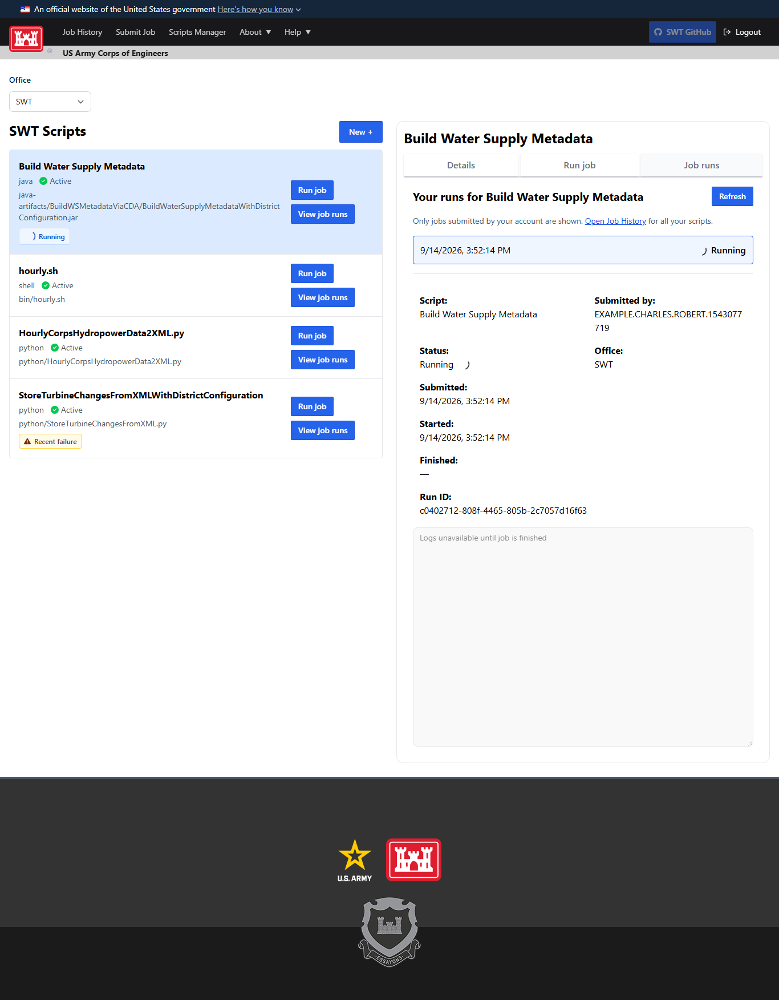
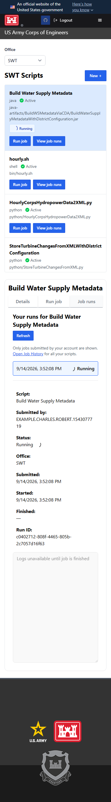

# Run jobs in Scripts Manager

1. Sign in, open **Scripts Manager**, and select your office.
2. Select a script row to open read-only **Details**, or select the row's **Edit** button
   to open **Details** with the edit form ready. Changes are applied only when saved.
3. Select **Run script** at the end of the row to open that script's **Run script** tab.
4. Review the saved file or executable and arguments, then select **Submit job** once.
5. The new run opens in **Run history**. Its status updates until it finishes, then output loads.
6. Use **Runs** on a row to return to that script's runs. Select **Open** on a run to inspect it;
   **Refresh** reloads the list. **Job History** shows your runs across all scripts, with an
   **Open** link on each entry that goes directly to its details and output.

The Groundwork tabs keep details, submission, and run output in the selected script's workspace.
Each row groups the script name, runtime, active state, and full path. Actions appear beside
that information when space permits and below it on smaller screens. The selected script
appears beside the list on wide screens and below it on narrower screens. Long paths and
run details wrap so the action buttons remain reachable without horizontal scrolling.

<details>
<summary>Wide-screen and phone layouts</summary>

On a wide screen, the script list and selected run share the workspace:



On a phone, scroll the script list to choose a script, then scroll down to its tabs:



</details>

Script rows show the status of your newest submitted run. A spinner indicates that run is
queued or running; a failure warning appears only if that latest run failed, regardless of age.
A newer successful run clears the warning even if an older run failed more recently.
Click an indicator to open that run. **Runs** opens the latest run by default; select an older
entry in **Run history** to inspect its details without changing the script's latest status.
Running jobs also show spinners in the run list. The manager refreshes run status every five
seconds while visible, including when a different tab is selected. A read failure stops polling;
**Retry run status** resumes it. The indicators remain scoped to your jobs in the selected office.


Both history views contain jobs submitted by the signed-in username. Existing `/events/jobs`
and `/events/jobs/{jobId}` links continue to work. **Submit Job** remains available for users
who can run scripts but do not have script administration access.

## Optional execution roles

New registrations start with no execution roles selected. An empty `roles` array means
no additional CDA execution role is required: the user's authenticated CDA profile must
still include the script's office. If roles are selected, at least one must match in that
office. Existing nonempty role lists keep their restrictions. Inactive scripts cannot run.
Catalog listing and job submission use the same checks, including direct API submissions.

This also makes existing registrations with empty role lists runnable by users with office
access. Script administration still requires Data Acquisition Mgr or Data Exchange Mgr.
Execution roles control who may submit a job; they do not give the running process CDA credentials.
Jobs that call CDA still need appropriate credentials in their execution environment.

## Bash without a CDA call

Register an **Installed command**, executable `bash`, with no roles selected. To inspect
the runner's time zone, enter these two arguments on separate lines:

```text
-lc
printf 'TZ=%s\n' "$TZ"
```

Save, choose **Run job**, and select **Submit job**. Read the output under **Job runs**.
The command uses the existing runner environment and does not make a CDA request.

## Screenshots

The in-app onboarding guide uses the maintained screenshots in `ui/public/about/`.
Capture updates with `PR_SCREENSHOT_DIR` set while running
`ui/tests/smoke/script-job-workflow.spec.ts`. Its API fixtures contain synthetic script
definitions and output; these images demonstrate the UI, not an AWS execution.
Keep PR-only screenshots outside the repository and copy only the intended documentation
images into `ui/public/about/`.

`ui/tests/smoke/script-responsive-layout.spec.ts` checks long names, paths, arguments,
and usernames at nine widths from 320 to 1920 pixels, plus 200% text size. It checks
the list and individual content boxes for overflow, verifies action-button bounds,
and exercises all three tabs. Set `PR_SCREENSHOT_DIR` to capture each layout.
